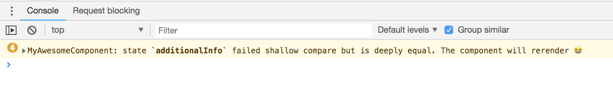

# react-update-checker [](https://travis-ci.org/YellowKirby/react-update-checker)

> Console warnings for when a React component updates even though the props/state
> are deeply equal.



## Install

```
$ npm install react-update-checker
```

## Usage

For components that extend `React.PureComponent`, simply
change the parent class to `ReactUpdateChecker` instead.

```diff
import ReactUpdateChecker from 'react-update-checker';

- class MyComponent extends React.PureComponent { }
+ class MyComponent extends ReactUpdateChecker { }
```

The above also works for components extending `React.Component`
but do not implement a `shouldComponentUpdate` method.

If your component _does_ have a `shouldComponentUpdate` method,
extend the `ReactUpdateChecker` class and call the super method
as the first statement in your `shouldComponentUpdate`

```diff
import ReactUpdateChecker from 'react-update-checker';

- class MyComponent extends React.Component {
+ class MyComponent extends ReactUpdateChecker {

    shouldComponentUpdate(newProps, newState) {
+     super.shouldComponentUpdate(newProps, newState);

      // existing shouldComponentUpdate logic here
    }
}
```

## API

When `process.env.NODE_ENV === 'production'`, the default export of this
package will simply be `React.PureComponent`. This prevents blasting the
`console` messages unexpectedly in a production environment.

### `ReactUpdateChecker`

```js
import { ReactUpdateChecker } from 'react-update-checker';

class MyComponent extends ReactUpdateChecker {}
```

The named export is identical to the default export, except it _always_
returns the custom class, regardless of `process.env.NODE_ENV`.

### `getFailedKeys(object1, object2)`

```
import { getFailedKeys } from 'react-update-checker';

const sameReference = {};

const oldProps = {
  id: 'some-id',
  letters: ['a', 'b', 'c'],
  obj: sameReference
};

const newProps = {
  letters: ['a', 'b', 'c'],
  obj: sameReference
};

getFailedKeys(oldProps, newProps);
// => ['letters']
```

Given 2 objects, returns a list of property keys where the corresponding values
are deeply equal but not shallowly equal. These are typically the prop/state
items that need to be adjusted to avoid a re-render. Note that this only checks
properties that are common between both objects. Any new or removed properties
are not included in the return value.

### `isShallowEqual(object1, object2)`

```
import { isShallowEqual } from 'react-update-checker';

isShallowEqual({ foo: 'bar' }, { foo: 'bar' });
// => true
```

Given 2 objects, returns whether or not all top-level properties are equal.
This is the exact same shallow comparison that is done by
`React.PureComponent`, just re-exported in this module for convenience.

## What about [`why-did-you-update`](https://github.com/maicki/why-did-you-update)?

**You should probably just use that project instead.** I originally needed something
more targeted (no monkey-patching React) and needed it to be painfully
obvious which prop/state names were causing the problem.

## License

MIT
